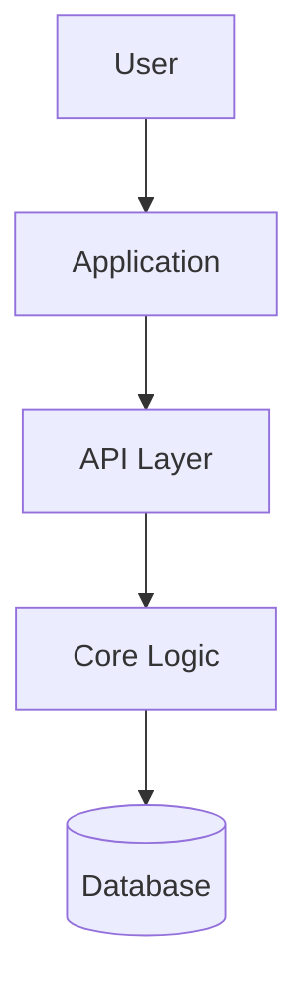
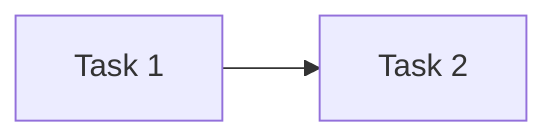

# Dev Handoff Guide - Converge v3

Use only after Converge Docs exist and the work is implementation-heavy. Write handoff artifacts under `converge-docs/dev-handoff/`.

## Trigger Conditions

All must be true:
- Output profile is Converge Docs for product, architecture, or implementation work.
- Intent, constraints, and recommendation are settled.
- Core risks and assumptions are recorded.
- The user asks for a technical handoff or the next actor is an engineer/agent.

## Files

```text
converge-docs/dev-handoff/
  01-tech-spec.md
  02-interface-contracts.md
  03-task-graph.md
  04-validation-plan.md
```

## 01-tech-spec.md

````markdown
# Tech Spec

## Objective

## Constraints

## Recommended Architecture



## Key Decisions
| Decision | Choice | Rationale | Alternatives Rejected |
|---|---|---|---|

## Data Model
| Entity | Fields | Relationships | Notes |
|---|---|---|---|

## Failure Modes
| Failure | Behavior | Recovery |
|---|---|---|
````

## 02-interface-contracts.md

````markdown
# Interface Contracts

## API / Function / Event: [Name]

- **Purpose**:
- **Caller**:
- **Auth/Permission**:
- **Input**:

```json
{
  "field": "type - meaning"
}
```

- **Output**:

```json
{
  "field": "type - meaning"
}
```

- **Errors**:
| Error | Condition | Caller Handling |
|---|---|---|

- **Notes**:
````

## 03-task-graph.md

````markdown
# Task Graph

## Tasks
| ID | Task | Priority | Depends On | Done When |
|---|---|---|---|---|

## Dependency Graph



## Critical Path
````

## 04-validation-plan.md

````markdown
# Validation Plan

## Acceptance Criteria
- [ ]

## Tests
| Test | Scope | Command/Method | Expected Result |
|---|---|---|---|

## Manual Checks
- [ ]

## Rollback / Recovery
````

## Rules

- Do not invent APIs, schemas, or deployment details if Converge Docs do not justify them.
- Label implementation assumptions explicitly.
- Keep tasks assignable; split any task estimated above 5 days.
- Include edge cases and error handling for every user-visible flow.
- If the technical path is underdetermined, return to Converge discovery instead of writing a fake spec.
